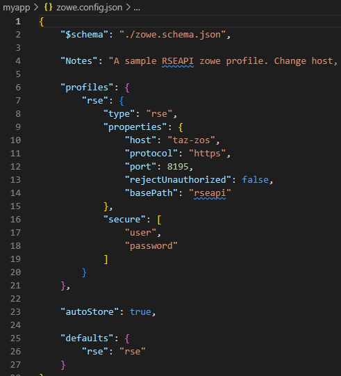
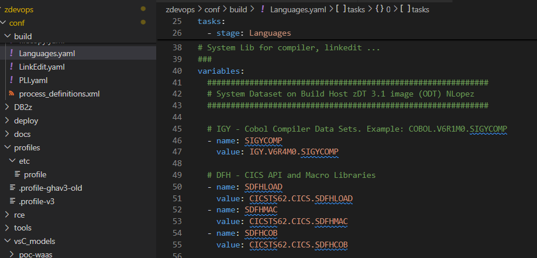
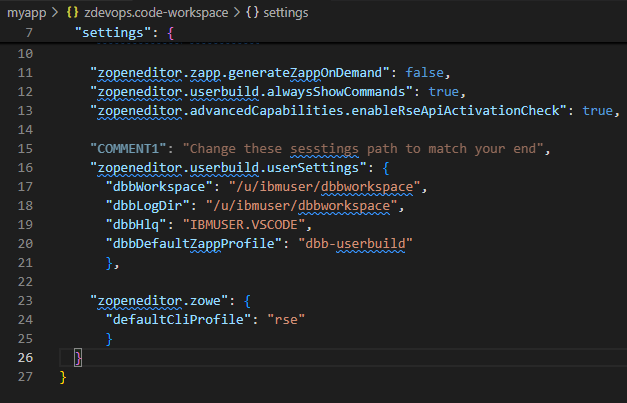

### DBB/VS Code Quick start notes (July 2025)
Goal: To configure VS Code and DBB for cloning, editing and push new branches to you git Server for Pipeline builds.

Normally the Z DevOps Admin coordinates the steps outlined here.  They would include Git and Artofy Admin as well as Z SysProgs, Security and Network teams as needed.

The first phase is to configure the varaious tools for Developers.  Once all components are verified, a **small select** group of Developers can be included for further verification, learning and customization.

## PreReqs: 
- After installing DBB v3 or better:  
- Obtain the install paths for: 
    - DBB its normally in ```/usr/lpp/IBM/dbb```    
    - Git for Z (check you SMPE install note)
- Ensure VS Code Users have an OMVS RACF segment with a personal USS Home dir.  
    - Define DBB and Git on the z DevOps Admin's home directory. This profile can be merged into /etc/profile for access by all users at a later time.  

## Phase1 - Z DevOps Configuration
- Edit zowe.config.json
    - Update the RSEAPI connection details  
      
    - Test Zowe:
        - open the your USS home dir 
        - create a folder called 'dbbworkspace' 

- copy the dbb sample config - change the uss path to match you env 
    - from the vs code terminal run this - but use your DBB install path 
        scp ibmuser@taz-zos:/usr/lpp/IBM/idz/usr/lpp/IBM/dbb/build/*.yaml  config\build
        scp ibmuser@taz-zos:/usr/lpp/IBM/idz/usr/lpp/IBM/dbb/samples/languages/*.yaml config\build


- Edit config/build/Languages.yaml 
    - add the system PDS for the cobol compiler (SIGYCOMP). 
    

- Edit the zdevops.code-workspace 
    - add your HLQ to  "dbbHlq"
    - add your rse zowe profile to  "defaultCliProfile"
    - open this workspace fodler as a workspace i nvs Code (botton right blue box)
    


Run A Feature build: 
- Create a dbb workspace dir on the user's USS home dir (like dbbworkspace)
- Create a branch 
- Make a change to the sample cobol pgm
- Run "IBM User Build with Full Upload" to init or referwsh dbb-app.yaml config changes. Afterwards, run the "User Build" options (its faster).  
- Review the local copy of the compiler and linkedit logs(sysprint)
- pus hthe branch to your git hub server 

## Phase2 - Run a pipeline 
rbd 


