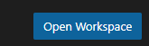

### 🛠️ DBB/VS Code Quick Start Notes (July 2025)

**Purpose:**
Configure VS Code with DBB, Zowe, and Open Editor to enable mainframe developers to build and test applications using modern DevOps tools.

Note: Always open this project's workspace file.

> 🔒 Typically, these steps are performed by the **Z DevOps Admin**, who may collaborate with the **z/OS SysProg**, **Security**, and **Network** teams as needed.

Once these steps are completed and verified, the setup can be rolled out to a **small** group of developers for hands-on testing, learning, and further customization.

---

## ✅ Prerequisites

* Install VS COde and the Git extension
* Install **DBB v3** (or newer) on zOS and note the installation path (usually `/usr/lpp/IBM/dbb`).
* Ensure all VS Code users:

  * Have an **OMVS RACF segment**.
  * Have a personal **USS home directory**.
* Define DBB and other environment variables in the **Z DevOps Admin’s** `.profile`. This profile can later be merged into `/etc/profile` for system-wide access.

---

## ⚙️ Phase 1 – Z DevOps Environment Setup

### 1. Configure Zowe

Edit [`zowe.config.json`](zowe.config.json):

* Follow the inline comments and guidance in the sample file.
* Test Zowe access:

  * Open your USS home directory.
  * Create a folder named `dbbworkspace`.

### 2. Import DBB Sample Configuration Files

Open a VS Code terminal and run the following `scp` commands to copy configuration files. Replace `yourID`, `yourHost`, and verify your DBB install path:

```sh
scp yourID@yourHost:/usr/lpp/IBM/dbb/build/*.yaml                  config/build
scp yourID@yourHost:/usr/lpp/IBM/dbb/samples/languages/*.yaml     config/build
```

### 3. Customize the Language YAML

Open [`Languages.yaml`](config/build/Languages.yaml#63) and:

* Uncomment the required section.
* Set `SIGYCOMP` to your COBOL compiler PDS name.

### 4. Configure the Workspace

Edit [`zdevops.code-workspace`](zdevops.code-workspace):

* Set your personal z/OS **HLQ** for PDS allocation:

  ```json
  "dbbHlq": "<your.HLQ>"
  ```
* Set the Zowe **CLI profile** created earlier:

  ```json
  "defaultCliProfile": "<your-profile>"
  ```

Activate the workspace:

* Click the **Open Workspace** button (bottom-right in VS Code).
  

### 5. Test DBB user Build  
* Commit all changes to this repo and push it to git 
* SSH into your zOS host and clone this repo under Z DewvOps Admins home dir
* Then run this cli:


BBMM need to set the dbb_home ... env vars . 


```ssh
dbb build file --hlq ibmuser.vscode  asample.cbl 
```
---

## 🧪 Phase 2 – Run a Feature Build

1. Create a `dbbworkspace` directory in your USS home.
2. Create a new Git branch.
3. Modify a sample COBOL program.
4. In VS Code, run:

   * `IBM User Build with Full Upload` – to initialize or refresh the `dbb-app.yaml` configuration.
   * Then use `IBM User Build` – for faster subsequent builds.
5. Review logs (SYSOUT, SYSPRINT) from the local copies of compiler/link-edit output.
6. Push the branch to your GitHub server.

---

## 🚀 Phase 3 – Run a Pipeline

Run a pipeline using your CI/CD tool (e.g., Jenkins or GitHub Actions) integrated with the DBB project.

---
